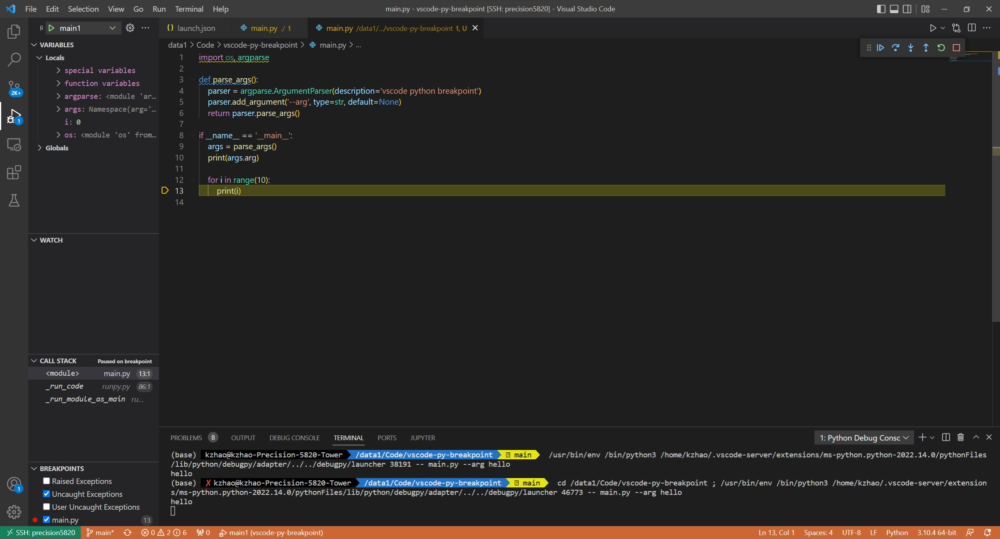

## vscode python breakpoint

1.  install [python extension](https://marketplace.visualstudio.com/items?itemName=ms-python.python). Click the `Extensions` button on the left of vscode and then search `python` in extensions.
2. add [launch.json](.vscode/launch.json) configuration file to `.vscode/`.
3. switch to debug console by clicking `debug icon` on the left side of vscode.
4. set breakpoints by clicking on the left of line numbers.
5. click `start to debug` button (or press F5) to start.

